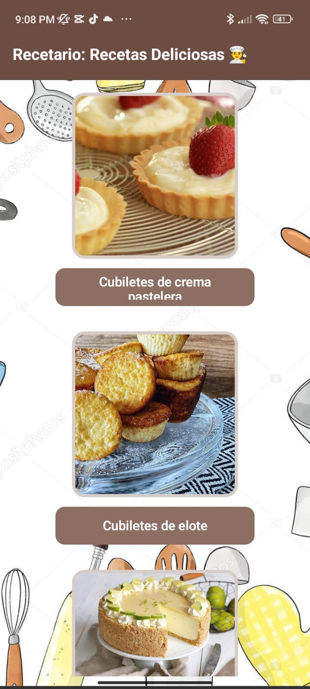
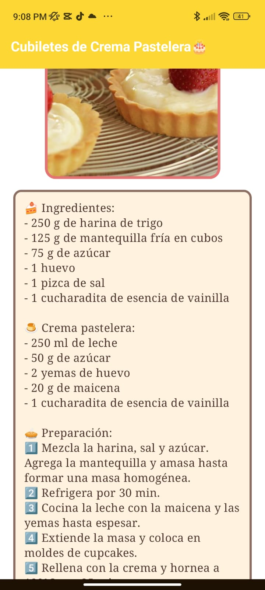
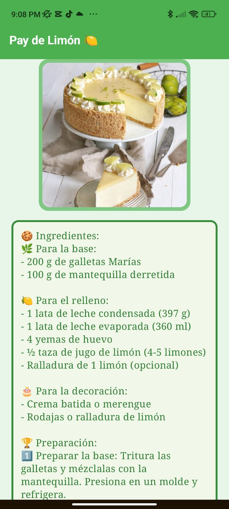
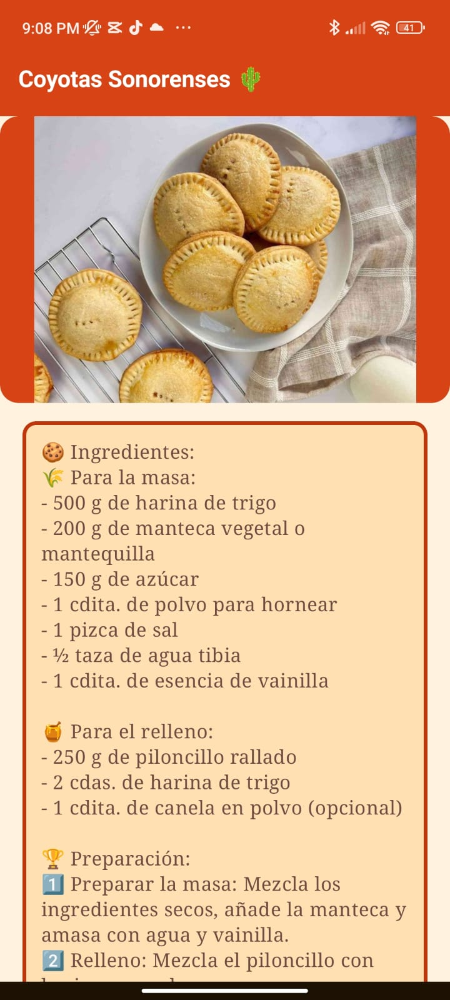

# Recetario - Aplicación Android

**Recetario** es una aplicación de Android desarrollada con Jetpack Compose, diseñada para mostrar recetas detalladas con imágenes, ingredientes y pasos de preparación. La app permite navegar entre distintas recetas mediante Jetpack Navigation, con una interfaz moderna y fluida.

## Características

- Visualización de recetas con imágenes, ingredientes y pasos detallados.
- Interfaz desarrollada con **Jetpack Compose**, aprovechando su eficiencia y facilidad para crear UI declarativas.
- Barra de navegación superior con título y colores personalizados para cada receta.
- Scroll vertical para ver recetas completas sin interrupciones.
- Navegación fluida entre pantallas usando **NavController**.

## Librerías utilizadas

- **Jetpack Compose**: Para la construcción de la UI de la aplicación.
- **Material 3**: Diseño moderno con componentes de Google Material 3.
- **Navigation Compose**: Manejo de la navegación entre pantallas.

## Capturas de pantalla

Aquí hay algunas capturas de pantalla del proyecto:

  
  
  
  

Alumno: Bryan De la Cruz Molina 22130528

## Clona este repositorio:
https://github.com/bryxanimol/Recetas
